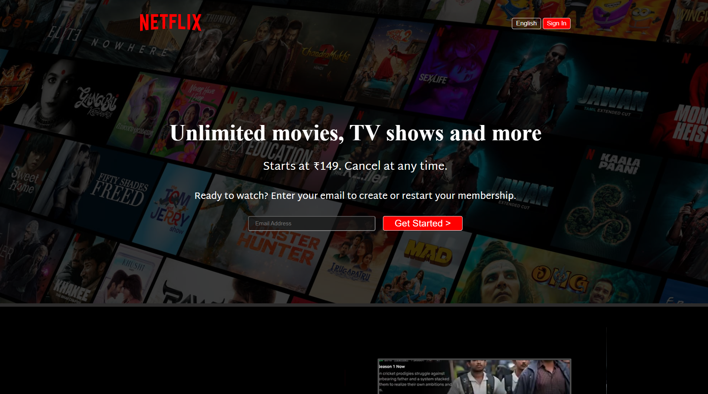
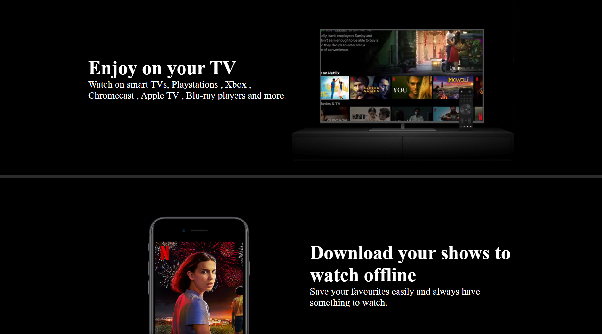
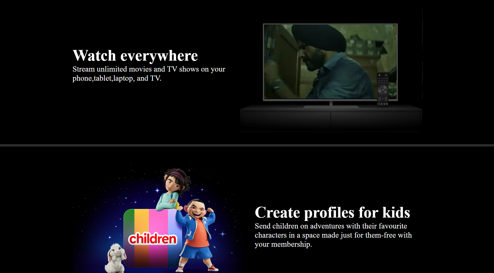
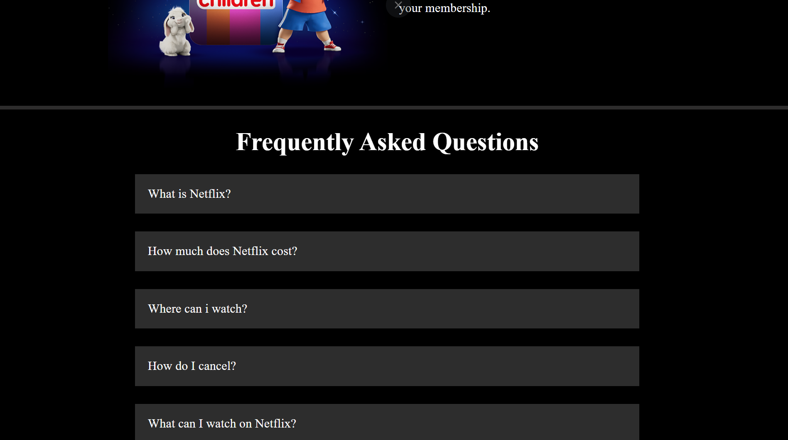

# 🎬 Netflix Clone (Frontend)

A visually accurate **Netflix landing page clone** built using **HTML5** and **CSS3** — fully responsive and lightweight.

---

## 🚀 Features

- ✅ Fully responsive layout
- ✅ Clean navigation bar with logo and buttons
- ✅ Hero section with call-to-action
- ✅ Multiple informative sections with images and videos
- ✅ Autoplay background videos (muted)
- ✅ FAQ section (static layout)
- ✅ Netflix-style footer with useful links

---

## 📁 Folder Structure

Netflix Clone/
├── index.html
├── style.css
├── favicon.ico
├── README.md
├── Assets/
│ ├── Images/
│ │ ├── image.png
│ │ ├── logo.svg
│ │ ├── Sec1.png
│ │ ├── Sec2.jpg
│ │ └── Sec3.png
│ └── Videos/
│ ├── Video1.m4v
│ └── Video2.m4v

## 🚀 How to Run

1. Download or clone the repository
2. Open `index.html` in your browser
3. Enjoy the Netflix UI experience!

## 💡 Improvements in Future

- Add a working sign-in page
- Make FAQ section interactive with JavaScript
- Optimize video playback across devices

## 🛠️ Tech Stack

- HTML5
- CSS

---

## 📷 Preview

Here are a few screenshots of the Netflix Clone UI:

---

Made with ❤️ by Sneha Singh
